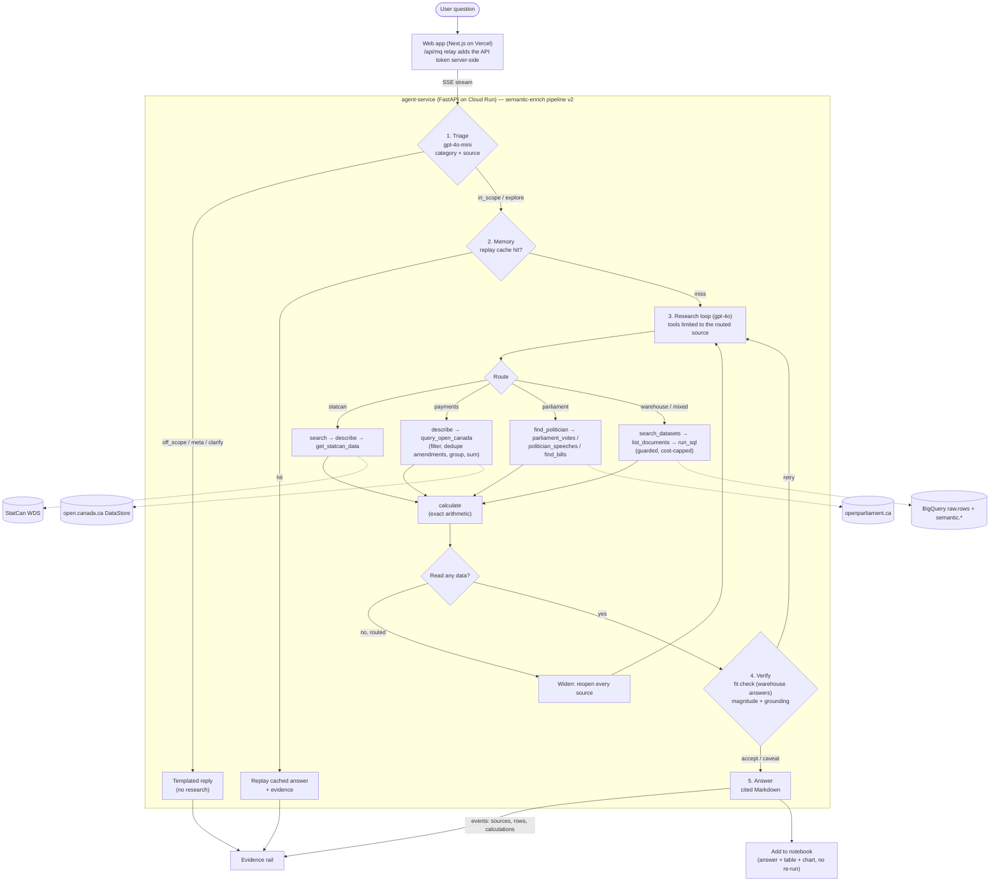

# MapleQuery

Ask hard questions about Canada; get answers you can cite.

MapleQuery is an LLM research agent over Canadian public data. Ask in
plain language ("How much has rent gone up since 2020?", "How did each
party vote on Bill C-4?", "How much did Canada give to Ukraine last
year?") and it finds the right official source, reads the actual
numbers, does the arithmetic exactly, and answers with a link to every
table, record or vote it used. A live evidence panel shows each step.

Live at **https://maple-query.vercel.app**.

## Sources

| Source | How it's read | Best for |
|---|---|---|
| **Statistics Canada** (~8,000 tables) | Live, Web Data Service API | Prices, GDP, income, jobs, population and immigration, housing, trade, government revenue, spending and debt |
| **open.canada.ca DataStore** | Live, CKAN DataStore API | Every grant and contribution, contract over $10K, travel and hospitality claim |
| **House of Commons record** | Live, openparliament.ca API | MPs, how each voted, bills and their status, Hansard speeches |
| **BigQuery warehouse** (~3,700 datasets) | Ingested from open.canada.ca CSVs | Program and departmental datasets with no live API |

Rule of thumb: read a source live when its publisher already serves a
query API; mirror it into the warehouse only when there is none, or
when answering needs joins across its raw rows
([`ARCHITECTURE.md`](ARCHITECTURE.md)).

## How a question is answered



1. **Triage** (one cheap call) decides whether the question is
   answerable, and which source it most likely lives in.
   Off-topic, opinion and character questions get a templated reply
   and cost almost nothing.
2. **Memory** replays an identical recent question from cache.
3. **Research** is a tool-calling loop. It only sees the routed
   source's tools (cheaper, fewer wrong turns); if that source returns
   no data it reopens every source before it may answer. Every derived
   figure (shares, per capita, real change) goes through `calculate`.
4. **Verify** checks warehouse answers for fit and magnitude; answers
   built from live series ship as written, with every value in the
   evidence rail.
5. **Answer** streams back with a link to each source, as Server-Sent
   Events the web app renders live.

Deeper detail: [`docs/services/semantic-enrich.md`](docs/services/semantic-enrich.md)
(pipeline, tools, routing), [`docs/services/agent-service.md`](docs/services/agent-service.md)
(API), [`docs/services/web.md`](docs/services/web.md) (UI, notebook).

## Repo map

| Path | What |
|---|---|
| `services/ingest` | CKAN → GCS raw landing (open.canada.ca CSVs) |
| `services/warehouse-load` | GCS → BigQuery `raw.documents` / `raw.rows` |
| `services/semantic-enrich` | Dataset/column enrichment + embeddings, **and the agent itself** (pipeline, tools, prompts, live-source clients) |
| `services/agent-service` | FastAPI wrapper: `/chat` SSE, datasets, SQL; deployed to Cloud Run on push to `main` |
| `web` | Next.js app: chat + evidence rail, notebook, explorer, dataset browser |
| `infra/terraform` | GCS, BigQuery, IAM, Cloud Run, CI identity |

## Checking the agent

Before merging anything that changes agent behaviour, run the live
end-to-end eval against the deployed agent and its baseline:

```bash
cd services/semantic-enrich
uv run python scripts/live_eval.py --baseline eval/reports/live-sources-baseline-2026-10-08.json
```

It asks the questions in `eval/questions-live-sources.yaml`, flags
anything that got worse (wrong route, no data, slower, costlier), and
caps spend (~$0.08 a question). Unit tests: `uv run pytest tests/unit`.

## Working on this repo

If you're an agent, **read [`AGENTS.md`](AGENTS.md) before any task.**

If you're a human:

- [`AGENTS.md`](AGENTS.md) — how agents should work in this repo.
- [`ARCHITECTURE.md`](ARCHITECTURE.md) — top-level pipeline and layering.
- [`docs/index.md`](docs/index.md) — full doc index.

## Setting up infra

We use Terraform to provision the project's cloud infrastructure (the
GCS bucket, service accounts, and — as later milestones land —
BigQuery datasets and the Cloud Run job). Everything lives in
`infra/terraform/`.

**You probably don't need to run this.** The infra is already up.
The steps below are only relevant if you're standing up a fresh GCP
project — team rotation, separate environment, DR rebuild, etc.

First-time setup:

```bash
# 1. Auth (gcloud CLI AND application-default — they are separate)
gcloud auth login
gcloud auth application-default login
gcloud config set project <your-project-id>

# 2. Enable the three APIs we need
gcloud services enable storage.googleapis.com iam.googleapis.com \
                       cloudresourcemanager.googleapis.com \
                       --project=<your-project-id>

# 3. Fill in your values (terraform.tfvars is gitignored)
cd infra/terraform
cp terraform.tfvars.example terraform.tfvars
$EDITOR terraform.tfvars

# 4. Apply
terraform init
terraform plan -out=tfplan
terraform apply tfplan
```

To add an admin: edit the `admin_users` list in `terraform.tfvars` and
re-apply.

To run the test suite (no GCP calls, dummy token works offline):

```bash
GOOGLE_OAUTH_ACCESS_TOKEN=fake terraform -chdir=infra/terraform test
```

## License

TBD.
